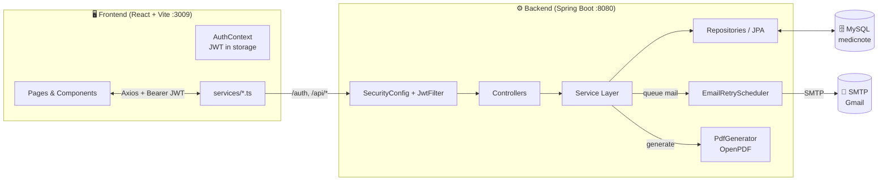
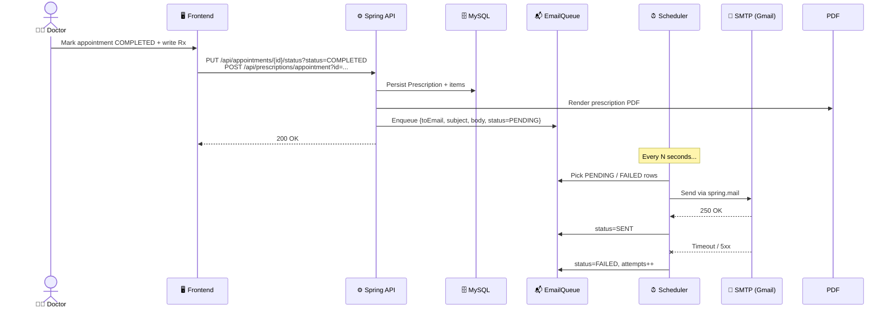
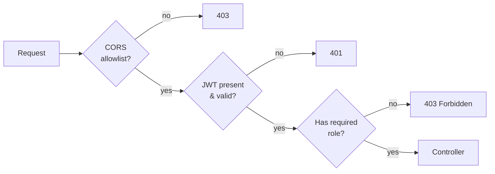
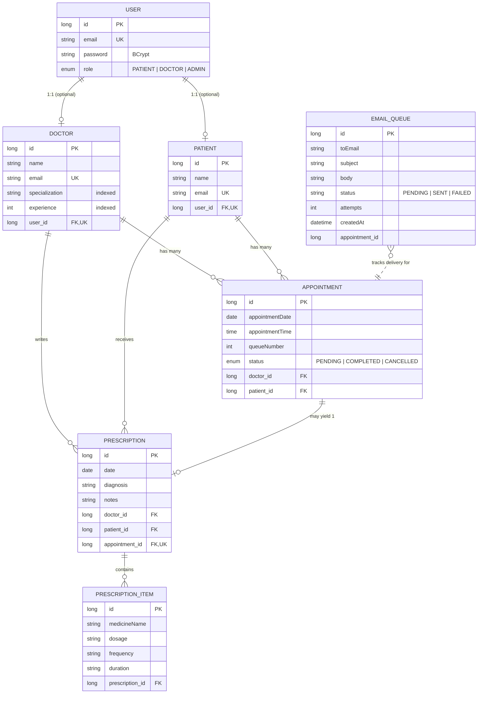
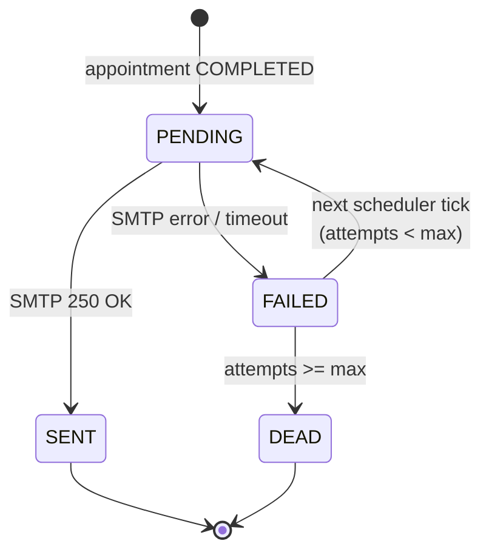

# 🩺 MedicNote

> A full-stack healthcare management platform that connects **doctors** and **patients** through appointment booking, prescription management, and email delivery — built with a secure REST API and a modern role-based dashboard UI.

[](#-tech-stack)
[](#-tech-stack)
[](#-tech-stack)
[](#-tech-stack)
[](#-api-documentation)

---

## 📑 Table of Contents

- [✨ What is MedicNote?](#-what-is-medicnote)
- [🏗️ Architecture](#-architecture)
- [🧩 Tech Stack](#-tech-stack)
- [👥 User Roles & Flows](#-user-roles--flows)
- [🚀 Features](#-features)
- [🔐 Authentication & Security](#-authentication--security)
- [📡 API Documentation](#-api-documentation)
- [🗃️ Data Model](#-data-model)
- [⚙️ Project Structure](#-project-structure)
- [🛠️ Getting Started](#-getting-started)
- [🔄 Email Delivery Pipeline](#-email-delivery-pipeline)
- [🧪 Testing](#-testing)
- [🤝 Contributing](#-contributing)
- [📄 License](#-license)

---

## ✨ What is MedicNote?

**MedicNote** is a healthcare workflow tool that lets patients book appointments with doctors, lets doctors manage their queue and write prescriptions, and automatically emails the prescription PDF to the patient when the doctor marks the appointment as **completed**.

It is a two-tier monorepo:

| Tier | Tech | Purpose |
|---|---|---|
| **Backend** | Spring Boot 3.3 + JPA + MySQL | REST API, JWT auth, business logic, PDF generation, async email |
| **Frontend** | React 18 + Vite + TypeScript + Tailwind + shadcn/ui | Role-based dashboard, forms, dashboards, doctor/patient views |

---

## 🏗️ Architecture



**Request flow for a prescription email:**



---

## 🧩 Tech Stack

### Backend

| Concern | Choice |
|---|---|
| Language | Java 17 |
| Framework | Spring Boot 3.3.5 |
| Web | Spring Web (REST controllers) |
| Persistence | Spring Data JPA + Hibernate |
| Database | MySQL (auto-created via `createDatabaseIfNotExist=true`) |
| Security | Spring Security + JWT (jjwt 0.11.5) |
| Validation | Jakarta Validation (Hibernate Validator) |
| Mapping | MapStruct 1.5.5 + Lombok |
| Email | Spring Mail (SMTP) |
| PDF | OpenPDF 1.3.30 |
| API docs | springdoc-openapi 2.6.0 (Swagger UI) |
| Build | Maven 3.x (`./mvnw`) |
| Scheduling | `@Scheduled` for email retry |

### Frontend

| Concern | Choice |
|---|---|
| Language | TypeScript 5 |
| Framework | React 18 |
| Build tool | Vite 5 |
| Styling | Tailwind CSS 3 + shadcn/ui (Radix primitives) |
| Routing | React Router DOM 6 |
| Data fetching | TanStack Query 5 + Axios (custom `useApi` / `usePaginated` hooks) |
| Forms | React Hook Form + Zod resolvers |
| Charts | Recharts |
| Toasts | Sonner |
| Dates | date-fns + react-day-picker |
| Carousels | embla-carousel-react |
| Test runner | Vitest + Testing Library + Playwright |
| Lint | ESLint 9 (typescript-eslint) |

---

## 👥 User Roles & Flows

The platform serves three roles, each routed to a dedicated dashboard:

```mermaid
flowchart TD
    Login([Login]) --> RoleCheck{Role?}
    RoleCheck -- admin --> AdminDash[/admin/dashboard]
    RoleCheck -- doctor --> DocDash[/doctor/dashboard]
    RoleCheck -- patient --> PatDash[/patient/dashboard]

    AdminDash --> A1[Manage doctors & patients]
    AdminDash --> A2[Full access via /api/doctors /api/patients]
    DocDash --> D1[Today's queue]
    DocDash --> D2[Patients search/filter]
    DocDash --> D3[Write prescriptions]
    DocDash --> D4[Mark COMPLETED → email PDF]
    PatDash --> P1[Browse doctors]
    PatDash --> P2[Book appointment]
    PatDash --> P3[View my prescriptions]
    PatDash --> P4[Download PDF / see timeline]
```

---

## 🚀 Features

### Patient
- 🔎 **Search doctors** by specialization and/or experience (paginated)
- 📅 **Book appointments** with a specific doctor at a chosen date & time
- ❌ **Cancel** pending appointments
- 📜 **View prescription history** (filter by date, doctor, or date range)
- ⬇️ **Download** any prescription as a watermarked PDF
- 🖥️ **Dashboard** with upcoming appointments and recent prescriptions

### Doctor
- 🧾 **Patient queue** for today
- 📋 **Patient list** (paginated) with search and date-range filters (today / weekly / custom)
- ✍️ **Write prescriptions** linked to an appointment, with multiple line items
- 🔄 **Update appointment status**: `PENDING → COMPLETED | CANCELLED`
- 📧 **Auto-emailed PDF** to the patient on completion (via background email queue)
- 🧑‍⚕️ **Profile management**

### Admin
- 👨‍⚕️ Full CRUD over doctors
- 🧑 Full CRUD over patients
- Same dashboard endpoints as the corresponding role

### Cross-cutting
- 🌗 **Dark/light theme** (`ThemeContext`)
- 🔔 **Toasts** for success / error feedback (`sonner`)
- 🦴 **Skeleton loaders** and **empty states** for every list
- 🛡️ **Method-level security** with `@PreAuthorize` and JWT principal
- 📨 **Resilient email pipeline** — failures retry instead of blocking the API

---

## 🔐 Authentication & Security

- Stateless JWT sessions (`Authorization: Bearer <token>`)
- BCrypt password hashing
- CORS allowlist: `localhost:3009`, `localhost:5173`, `localhost:8080`
- Public endpoints: `/auth/**`, `/error`, `/v3/api-docs/**`, `/swagger-ui/**`
- All other endpoints require a valid JWT
- Method-level role enforcement via `@PreAuthorize("hasRole('PATIENT')")` etc.
- Centralized error handling via `GlobalExceptionHandler`



---

## 📡 API Documentation

Full OpenAPI docs are auto-generated at runtime:

| URL | Purpose |
|---|---|
| `http://localhost:8080/swagger-ui.html` | Interactive Swagger UI |
| `http://localhost:8080/v3/api-docs` | Raw OpenAPI 3 JSON |

### Endpoint summary

| Group | Method | Path | Roles |
|---|---|---|---|
| Auth | `POST` | `/auth/register` | public |
| Auth | `POST` | `/auth/login` | public |
| Doctors | `POST` `/api/doctors` | create | `ADMIN` |
| Doctors | `GET`  `/api/doctors` | list all | `ADMIN`, `PATIENT` |
| Doctors | `GET`  `/api/doctors/me` | self profile | `ADMIN`, `DOCTOR` |
| Doctors | `PUT`  `/api/doctors/me` | update self | `ADMIN`, `DOCTOR` |
| Doctors | `PUT`  `/api/doctors/{id}` | update | `ADMIN` |
| Doctors | `DELETE` `/api/doctors/{id}` | delete | `ADMIN` |
| Doctors | `GET`  `/api/doctors/search` | filter | `ADMIN`, `PATIENT` |
| Doctors | `GET`  `/api/doctors/search-paginated` | filter + page | `ADMIN`, `PATIENT` |
| Patients | `GET`  `/api/patients/me` | self | `PATIENT` |
| Patients | `PUT`  `/api/patients/me` | update self | `PATIENT` |
| Patients | `GET`  `/api/patients` | list | `ADMIN` |
| Patients | `GET`  `/api/patients/doctor/me` | my patients | `DOCTOR` |
| Patients | `GET`  `/api/patients/doctor/me/search` | search | `DOCTOR` |
| Patients | `GET`  `/api/patients/doctor/me/today` | today | `DOCTOR` |
| Patients | `GET`  `/api/patients/doctor/me/weekly` | weekly | `DOCTOR` |
| Appointments | `POST` `/api/appointments` | book | `PATIENT` |
| Appointments | `GET`  `/api/appointments/doctor/me/queue` | today's queue | `DOCTOR`, `ADMIN` |
| Appointments | `GET`  `/api/appointments/doctor/me` | doctor's appts | `DOCTOR`, `ADMIN` |
| Appointments | `GET`  `/api/appointments/patient/me` | my appts | `PATIENT`, `ADMIN` |
| Appointments | `GET`  `/api/appointments/patient/me/history` | history | `PATIENT`, `ADMIN` |
| Appointments | `PUT`  `/api/appointments/{id}/status?status=...` | update | `DOCTOR`, `ADMIN` |
| Appointments | `PUT`  `/api/appointments/{id}/cancel` | cancel | `PATIENT`, `ADMIN` |
| Appointments | `GET`  `/api/appointments/doctor/{id}/availability` | open slots | `PATIENT`, `ADMIN` |
| Prescriptions | `POST` `/api/prescriptions` | create | `DOCTOR` |
| Prescriptions | `POST` `/api/prescriptions/appointment?id=...` | from appt | `DOCTOR` |
| Prescriptions | `POST` `/api/prescriptions/email` | by email | `DOCTOR` |
| Prescriptions | `GET`  `/api/prescriptions/patient/me` | mine | `PATIENT`, `ADMIN` |
| Prescriptions | `GET`  `/api/prescriptions/patient/me/date?date=...` | by date | `PATIENT`, `ADMIN` |
| Prescriptions | `GET`  `/api/prescriptions/patient/me/doctor?doctorName=...` | by doctor | `PATIENT`, `ADMIN` |
| Prescriptions | `GET`  `/api/prescriptions/patient/me/range?start=...&end=...` | by range | `PATIENT`, `ADMIN` |
| Prescriptions | `GET`  `/api/prescriptions/doctor/me/patient/{id}` | doctor's view | `DOCTOR`, `ADMIN` |
| Prescriptions | `GET`  `/api/prescriptions/doctor/me/date?date=...` | doctor by date | `DOCTOR`, `ADMIN` |
| Prescriptions | `GET`  `/api/prescriptions/{id}` | detail | any auth |
| Prescriptions | `GET`  `/api/prescriptions/{id}/download` | PDF | any auth |
| Dashboard | `GET`  `/api/dashboard/doctor/me` | doctor summary | `DOCTOR`, `ADMIN` |
| Dashboard | `GET`  `/api/dashboard/patient/me` | patient summary | `PATIENT`, `ADMIN` |

---

## 🗃️ Data Model



Unique constraints worth noting:
- `appointments`: `(doctor_id, appointmentDate, queueNumber)` and `(doctor_id, appointmentDate, appointmentTime)`
- `prescriptions`: `(doctor_id, patient_id, date)`
- `prescriptions.appointment_id`: unique (1 prescription per appointment)
- `email_queue.appointment_id`: unique
- `users.email`, `doctors.email`, `patients.email`: unique

---

## ⚙️ Project Structure

```
medicnote/
├── medicnote-backend/                # Spring Boot API
│   ├── pom.xml
│   ├── mvnw, mvnw.cmd
│   └── src/main/
│       ├── java/com/medicnote/backend/
│       │   ├── MedicnoteBackendApplication.java
│       │   ├── config/StartupLogger.java
│       │   ├── controller/          # REST controllers
│       │   │   ├── AuthController.java
│       │   │   ├── AppointmentController.java
│       │   │   ├── DoctorController.java
│       │   │   ├── PatientController.java
│       │   │   ├── PrescriptionController.java
│       │   │   └── DashboardController.java
│       │   ├── dto/                 # Request/response shapes
│       │   │   ├── auth/ dashboard/ request/ response/
│       │   ├── entity/              # JPA entities
│       │   │   ├── User.java Doctor.java Patient.java
│       │   │   ├── Appointment.java Prescription.java PrescriptionItem.java
│       │   │   ├── AppointmentStatus.java EmailQueue.java
│       │   ├── exception/           # Custom + global handler
│       │   ├── mapper/              # MapStruct mappers
│       │   ├── repository/          # Spring Data JPA repos
│       │   ├── scheduler/EmailRetryScheduler.java
│       │   ├── security/            # JWT filter, util, config, enums
│       │   ├── service/             # Interfaces + impl/
│       │   │   ├── Auth/Appointment/Doctor/Patient/Prescription/Dashboard
│       │   │   ├── EmailService + EmailQueueService
│       │   │   └── background/
│       │   └── util/PdfGenerator.java
│       └── resources/application.properties
│
└── medicnote-frontend/              # React + Vite SPA
    ├── package.json vite.config.ts tailwind.config.ts
    ├── .env                          # VITE_PORT=3009, VITE_API_BASE_URL=http://localhost:8080
    ├── components.json               # shadcn config
    └── src/
        ├── main.tsx App.tsx
        ├── api/                      # axiosClient + endpoints map
        ├── components/
        │   ├── ui/                   # shadcn primitives
        │   ├── layout/               # DashboardLayout, Navbar, Sidebar
        │   ├── dashboard/            # StatsCard, WelcomeBanner, etc.
        │   ├── appointment/ doctor/ patient/ prescription/ common/
        ├── context/                  # AuthContext, ThemeContext
        ├── hooks/                    # useAuth, useApi, usePaginated, useDebounce
        ├── lib/                      # utils, constants, formatters, jwt, errorHandler
        ├── pages/
        │   ├── auth/Login Register
        │   ├── admin/AdminDashboard
        │   ├── doctor/{Dashboard, Patients, Prescriptions, Queue, Profile}
        │   └── patient/{Dashboard, Doctors, Prescriptions, Records, Profile}
        ├── routes/{AppRoutes, ProtectedRoute}
        ├── services/                 # One service per backend controller
        └── types/                    # TS types mirroring backend DTOs
```

---

## 🛠️ Getting Started

### Prerequisites

| Tool | Version |
|---|---|
| JDK | 17+ |
| Node.js | 18+ (LTS recommended) |
| MySQL | 8.x running on `localhost:3306` |
| Maven | bundled via `./mvnw` |

### 1) Configure the backend

Edit `medicnote-backend/src/main/resources/application.properties`:

```properties
spring.datasource.url=jdbc:mysql://localhost:3306/medicnote?createDatabaseIfNotExist=true
spring.datasource.username=YOUR_MYSQL_USER
spring.datasource.password=YOUR_MYSQL_PASSWORD

jwt.secret=REPLACE_WITH_A_LONG_RANDOM_STRING

# Email (Gmail example — use an App Password, not your real password)
spring.mail.host=smtp.gmail.com
spring.mail.port=587
spring.mail.username=YOUR_GMAIL@gmail.com
spring.mail.password=YOUR_APP_PASSWORD
spring.mail.properties.mail.smtp.auth=true
spring.mail.properties.mail.smtp.starttls.enable=true
```

> ⚠️ The repo intentionally ships `application.properties` with empty secrets. Fill them in locally; **never commit real credentials**.

### 2) Run the backend

```bash
cd medicnote-backend
./mvnw spring-boot:run
```

API listens on `http://localhost:8080`. Swagger UI: `http://localhost:8080/swagger-ui.html`.

### 3) Run the frontend

```bash
cd medicnote-frontend
npm install
npm run dev
```

Vite serves on `http://localhost:3009` and proxies to the backend (CORS is configured on the server).

### 4) Build for production

```bash
# Backend
cd medicnote-backend && ./mvnw clean package
# produces target/medicnote-backend-0.0.1-SNAPSHOT.jar

# Frontend
cd medicnote-frontend && npm run build
# outputs to dist/
```

---

## 🔄 Email Delivery Pipeline

Prescription emails **never block the request thread**. The flow is:



- `EmailQueue` row is enqueued with `status=PENDING` and `attempts=0`
- `EmailRetryScheduler` (a `@Scheduled` bean) periodically scans `PENDING`/`FAILED` rows
- Failures increment `attempts`; admins can inspect the queue table for stuck rows
- Successful sends are marked `SENT`

This keeps the API responsive even if the SMTP server is down.

---

## 🧪 Testing

| Project | Command |
|---|---|
| Backend | `./mvnw test` (Spring Boot test starter) |
| Frontend | `npm test` (Vitest) or `npm run test:watch` |
| E2E (frontend) | `npx playwright test` (Playwright is in devDeps) |
| Lint (frontend) | `npm run lint` |

---

## 🤝 Contributing

1. Create a feature branch from `main`
2. Make your change with focused commits
3. Run the relevant tests + linter
4. Open a pull request describing the change and any screenshots

The repo currently has parallel feature branches from each contributor: `Giri`, `giri2`, `janhavi`, `meghana`, `samprit`. Coordinate before force-pushing to shared branches.

---

## 📄 License

Internal internship project — license to be decided. All rights reserved by the project owners unless stated otherwise.

---

<p align="center">
  Built with ❤️ during the <b>Infretrek Internship</b>.
</p>
